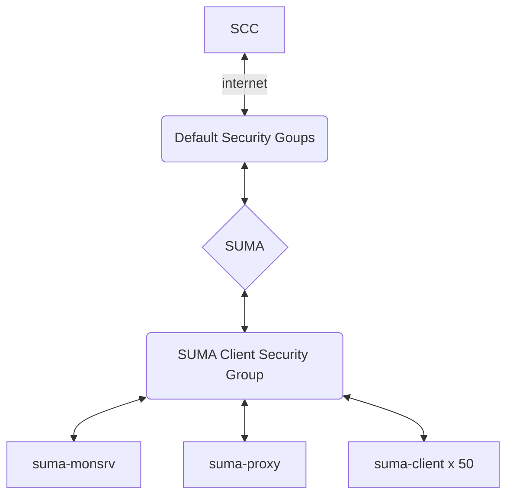

# suma-interactive-demo-environment

Building out an interactive demo environment for SUMA.

To build out this environment you will need to know SUSE Manager or Uyuni.
You will also need access to AWS as this demo environment uses AWS EC2 machines, but can be adapted to use other cloud environments in the future.

## THINGS TO KNOW:

#### What this deployment doesn't do. 

- VPC Deployment
- local DNS between machines
- SUSE Manager 
	- File system automation
	- Deployment automation
	- Orgnisations Automaticly populated
	- Attach to SCC and sync software repos
- Attach any clients to SUSE Manager

## THINGS TO DO:

Security Groups

1. default 

Using the 'default' as the first security group for SUSE Manager this needs to have 
- Outbound access the internet to reach SUSE Customer Center.  
- Inbound: 
	- http (80) & https (443) are needed to allow access to the SUSE Manager UI.
    - SSH will be needed but lock this down 'select: My IP' with in the AWS UI.  

External access is necessary to SUSE Manager Server to run the interactive sessions for external access.  
- All traffic trusted from the second security group 'security_groups = ["suma-clients"]' has been defined in the deployment for the client servers.

2. suma-client
	- Outbound: All trafic 
	- Inbound: 
		- All Traffic trusted -to- subnet of 'default' security group 
		- SSH Allout from trusted IP (My IP)

######** Avoid providing SSH Access to External users for this demo environment.  Shell commands to client machiens can be run from within the SUSE Manaher UI.

# Ready to Deploy....

#### 1. Edit the 'terraform.tfvars'

	# AWS access key used to create infrastructure
	aws_access_key = "<key>"

	# AWS secret key used to create AWS infrastructure
	aws_secret_key = "<key>"

	# AWS region used for all resources
	aws_region = "eu-west-1"

	# SUSE Manager Subscription Key
	suse_manager_subscription = "<key>"

##### [Note] The deployment has been currently tested on AWS eu-west-1 the ami images used might need to be changed for your local region.

##### [note]  SUSEConnect subscription registration of the SUSE Manager Server is part of the automation also the sle-module-public-cloud are loaded in the terraform deployment as well. You will need to edit the terraform.tfvars file and specify your SUSE Manager registation key.

	Run 'terraform init'
	Run 'terraform plan' 
	Run 'terraform init'
	
The process will deploy the following. 

- SUSE Manager server 4CPU 16GB Mem, bootdisk, datadisk (suma)
- SUSE Manaer Proxy Server 1CPU 4GBMem, bootdisk, datadisk (suma-proxy)
- SUSE Manager Monitor Server 1CPU 4GB Mem, bootdisk (suma-monsrv)
- SUSE Manager Client Machines are using SLE15SP3 and number of machines deployed can be changed in the 'infra.tf' look for 'count = 1' [# Tested with 50 instances]

### Why SLE15SP3 - This will allow you to show the SP upgrade also skip betweeng service packs. 
 
Once the deployment has completed, you will have several machines that are ready to go, all machines have the /etc/hosts file updated with the SUSE Manager Server details.  Currently There is no DNS on the virtual machine network. [Working on changing this.]

##### AWS Elastic IP attached to the SUSE MAnager node is (Optional)

Connect to the server(s) via ssh using the 'demo-suma.pem' this is automatically generated and located in the 'terraform.tfstate.d' directory within you deployment directory.

	- 'zypper up' patch and reboot the node.  (Note this is a BYOS deployment)

##### Prepare storage volumes [Future plan to automate this]

	-- hwinfo --disk | grep -E "Device File:"
	-- /usr/bin/suma-storage <devicename>

##### Example: 
	suma:~ # hwinfo --disk | grep -E "Device File:"
	Device File: /dev/nvme0n
	Device File: /dev/nvme1n1

	suma:~ # /usr/bin/suma-storage /dev/nvme1n1
	--> Checking disk for content signature
	--> Creating partition on disk /dev/nvme1n1
	--> Creating xfs filesystem
	--> Mounting storage at /manager_storage
	--> Syncing SUSE Manager Server directories to storage disk(s)
	--> Creating entry in /etc/fstab

Now run 'zypper up' and patch the system once done reboot the instance. 

Reconnect:

- Installing SUSE Manager follow the public cloud docs: 
	https://documentation.suse.com/suma/4.3/en/suse-manager/installation-and-upgrade/pubcloud-setup.html

### gen_orgs.sh

- This script need to coppied to the SUSE Manager machine and run, this is responsible for the seup up of the Orgnisations, OrgUsers also default password.  The script uses 'spacecmd' to preform its tasks.  PLEASE Note you will need to edit the script with the SUSE Manager 'admin' password.

  
